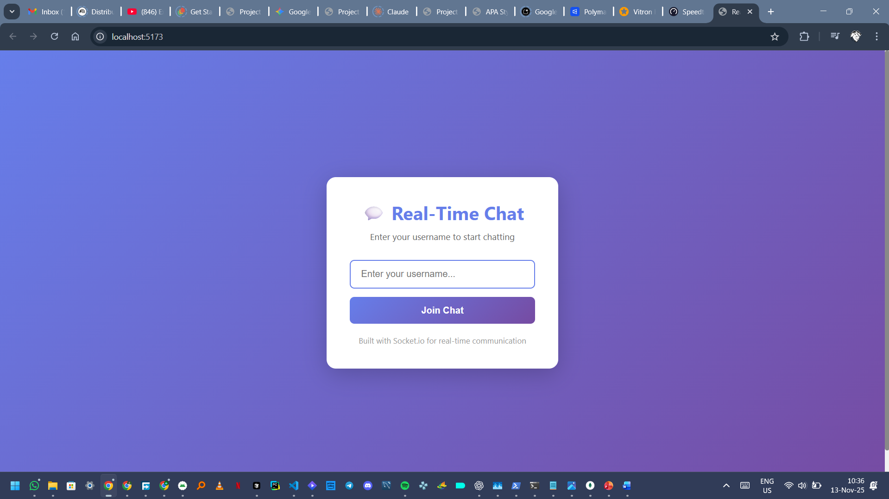
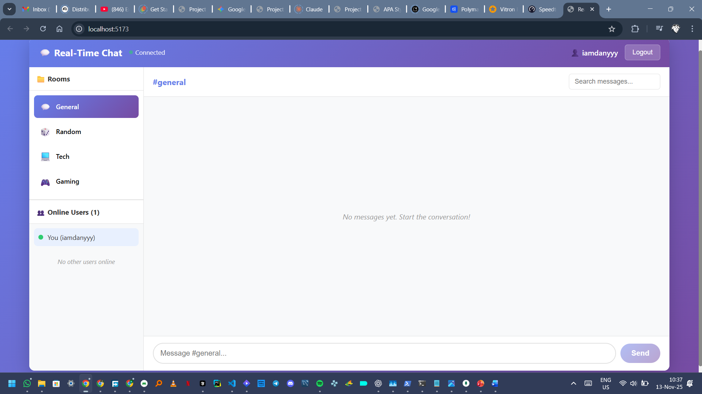
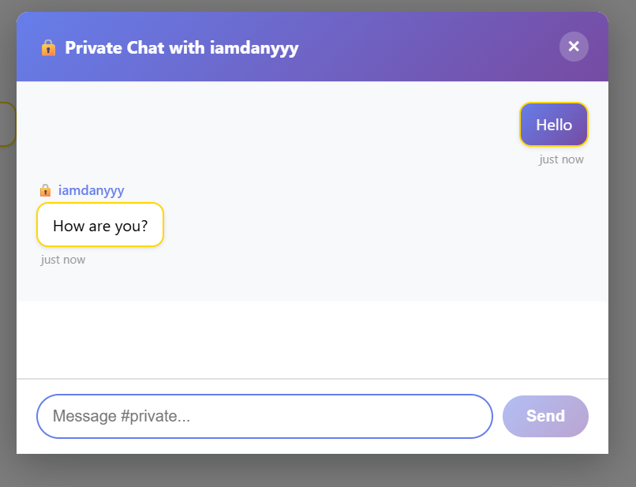

# 💬 Real-Time Chat Application with Socket.io

A full-stack real-time chat application built with Node.js, Express, Socket.io, and React. This project demonstrates bidirectional communication between clients and server using WebSockets.

## 📋 Table of Contents

- [Overview](#overview)
- [Features](#features)
- [Tech Stack](#tech-stack)
- [Project Structure](#project-structure)
- [Setup Instructions](#setup-instructions)
- [Running the Application](#running-the-application)
- [Features Explained](#features-explained)
- [Screenshots](#screenshots)
- [Deployment](#deployment)
- [Future Improvements](#future-improvements)

## 🎯 Overview

This is a university assignment project that implements a real-time chat application using Socket.io. The application allows multiple users to communicate in real-time through different chat rooms, send private messages, react to messages, and receive notifications.

The project consists of:
- **Backend**: Node.js + Express server with Socket.io for real-time communication
- **Frontend**: React application with Socket.io client for bidirectional communication

## ✨ Features

### Core Features
- ✅ **Username-based Authentication**: Simple login with just a username (no password required)
- ✅ **Global Chat Room**: Default "general" room where all users can chat
- ✅ **Real-time Messaging**: Instant message delivery using Socket.io
- ✅ **Message Timestamps**: Each message shows when it was sent
- ✅ **Typing Indicators**: See when other users are typing
- ✅ **Online/Offline Status**: View all currently connected users

### Advanced Features (3+ implemented)
- ✅ **Multiple Chat Rooms**: Switch between different rooms (General, Random, Tech, Gaming)
- ✅ **Private Messaging**: Send direct messages to other users
- ✅ **Message Reactions**: Add emoji reactions (👍, ❤️, 😂, etc.) to messages
- ✅ **Unread Message Counts**: Track unread messages per room
- ✅ **Message Search**: Search through messages in the current room
- ✅ **Message Pagination**: Load older messages when scrolling up

### Notifications
- ✅ **Join/Leave Notifications**: System messages when users join or leave
- ✅ **Sound Notifications**: Audio alert for new messages (when not in current room)
- ✅ **Browser Notifications**: Desktop notifications for new messages
- ✅ **Unread Counts**: Visual indicators showing unread message counts per room

### UX & Performance
- ✅ **Auto-reconnection**: Automatically reconnects if connection is lost
- ✅ **Responsive Design**: Works on both desktop and mobile devices
- ✅ **Message History**: View previous messages when joining a room
- ✅ **Smooth Animations**: UI transitions and message animations

## 🛠️ Tech Stack

### Backend
- **Node.js**: JavaScript runtime
- **Express**: Web framework for Node.js
- **Socket.io**: Real-time bidirectional event-based communication
- **CORS**: Cross-origin resource sharing
- **dotenv**: Environment variable management

### Frontend
- **React**: UI library
- **Vite**: Build tool and dev server
- **Socket.io-client**: Client-side Socket.io library
- **CSS3**: Styling with modern CSS features

## 📁 Project Structure

```
real-time-communication-with-socket-io/
├── server/
│   ├── server.js              # Main server file with Socket.io setup
│   ├── package.json            # Server dependencies
│   └── .env.example           # Environment variables template
│
├── client/
│   ├── src/
│   │   ├── components/        # React components
│   │   │   ├── Login.jsx      # Login screen
│   │   │   ├── Chat.jsx       # Main chat interface
│   │   │   ├── MessageList.jsx # Message display component
│   │   │   ├── Message.jsx    # Individual message component
│   │   │   ├── MessageInput.jsx # Message input component
│   │   │   ├── UserList.jsx   # Online users list
│   │   │   ├── RoomList.jsx   # Chat rooms list
│   │   │   └── PrivateMessageModal.jsx # Private message modal
│   │   ├── socket/
│   │   │   └── socket.js      # Socket.io client setup and hooks
│   │   ├── App.jsx            # Main app component
│   │   ├── main.jsx           # React entry point
│   │   └── index.css          # Global styles
│   ├── index.html             # HTML template
│   ├── package.json           # Client dependencies
│   └── vite.config.js         # Vite configuration
│
├── README.md                   # This file
└── Week5-Assignment.md         # Assignment instructions
```

## 🚀 Setup Instructions

### Prerequisites

Make sure you have the following installed:
- **Node.js** (v18 or higher) - [Download here](https://nodejs.org/)
- **npm** (comes with Node.js) or **yarn**

### Step 1: Clone the Repository

```bash
git clone <your-repository-url>
cd real-time-communication-with-socket-io-iamdanyyy
```

### Step 2: Install Server Dependencies

```bash
cd server
npm install
```

### Step 3: Install Client Dependencies

```bash
cd ../client
npm install
```

### Step 4: Environment Setup

Create a `.env` file in the `server` directory:

```bash
cd ../server
cp .env.example .env
```

Edit the `.env` file (optional, defaults work for local development):
```
PORT=5000
CLIENT_URL=http://localhost:5173
```

For the client, create a `.env` file in the `client` directory (optional):
```
VITE_SOCKET_URL=http://localhost:5000
```

## 🏃 Running the Application

### Development Mode

You need to run both the server and client simultaneously.

**Terminal 1 - Start the Server:**
```bash
cd server
npm run dev
```

The server will start on `http://localhost:5000`

**Terminal 2 - Start the Client:**
```bash
cd client
npm run dev
```

The client will start on `http://localhost:5173`

### Production Build

**Build the client:**
```bash
cd client
npm run build
```

**Start the server:**
```bash
cd server
npm start
```

## 📖 Features Explained

### 1. Real-time Messaging
Messages are sent instantly using Socket.io's event-based system. When a user sends a message, it's broadcast to all users in the same room in real-time.

### 2. Multiple Chat Rooms
Users can switch between different chat rooms. Each room maintains its own message history. The available rooms are:
- **General**: Default room for general discussion
- **Random**: For random topics
- **Tech**: Technology-related discussions
- **Gaming**: Gaming discussions

### 3. Private Messaging
Click on any user in the user list to start a private conversation. Private messages are only visible to the sender and recipient.

### 4. Message Reactions
Hover over any message and click the "+" button to add an emoji reaction. Click the same reaction again to remove it.

### 5. Typing Indicators
When someone is typing, other users in the same room will see a "typing..." indicator.

### 6. Notifications
- **Sound**: A beep sound plays when you receive a message in a different room or a private message
- **Browser Notifications**: Desktop notifications appear (requires permission)
- **Unread Counts**: Badges show how many unread messages are in each room

### 7. Auto-reconnection
If the connection is lost, Socket.io automatically attempts to reconnect. The connection status is shown in the header.

### 8. Message Search
Use the search bar in the room header to search for messages by content or sender name.

## 📸 Screenshots

### Login Screen

*Simple username-based login interface*

### Chat Interface

*Main chat interface with rooms, users, and messages*

### Private Messaging

*Private message modal for direct conversations*

### Message Reactions

*Adding emoji reactions to messages*
